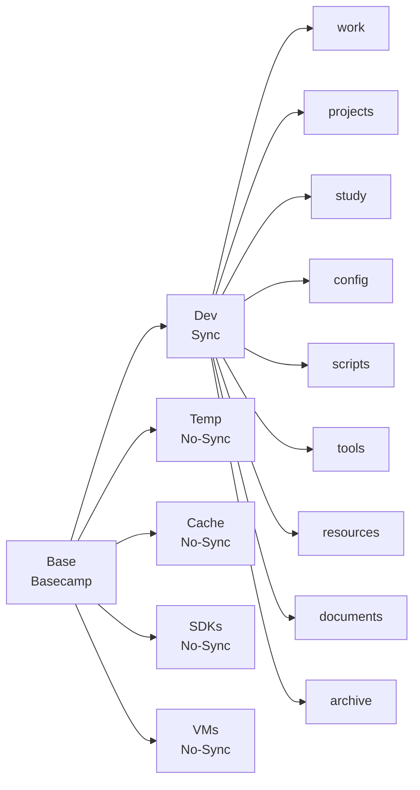

# 🛠️ Workspace Setup

백엔드 개발자를 위한 효율적인 로컬 디렉터리 구조 및 환경 설정 가이드입니다.
드라이브 루트(`Z:\`, `D:\` 등) 아래를 `Base` 폴더로 한 번 묶고, 그 안을 `Dev`, `Temp`, `Cache`, `SDKs`, `VMs`로 나누어 관리합니다. 여기서 `Base`는 베이스캠프(Basecamp)의 줄임말로, 개발 환경의 출발점이자 복구 기준점이라는 의미를 담고 있습니다.

데이터의 **중요도(Value)**와 **수명(Lifecycle)**에 따라 백업 영역(`Dev`)과 비백업 영역을 철저히 분리하여 생산성과 유지보수성을 높이는 것이 목표입니다.

## 🎯 전제 조건

1. **Backup Strategy:** `Base/Dev` 폴더만 동기화(Cloud/HDD)하면 핵심 작업 자산이 보존되어야 합니다.
2. **Fast Recovery:** OS 재설치 시 `Base/Dev/config`, `Base/Dev/tools`, `Base/Dev/scripts`를 중심으로 환경 복구가 가능해야 합니다.

<br>

## 📂 Directory Structure

```text
DriveRoot (ex: Z:\, D:\)/
└── Base/                    # 개발 환경의 베이스캠프
    ├── Dev/                 # [Sync] Cloud Drive 또는 주기적 외장하드 백업 대상
    │   ├── work/            # 회사 업무 (Git 계정 분리 권장)
    │   ├── projects/        # 개인/팀 프로젝트 (GitHub 등 원격 저장소 연동)
    │   ├── study/           # 학습 코드, 실습, 알고리즘 풀이
    │   ├── config/          # IDE 설정, dotfiles, 개발환경 설정 백업
    │   ├── scripts/         # 자동화 스크립트, 개인 CLI 도구
    │   ├── tools/           # 설치 없이 실행 가능한 포터블 도구
    │   ├── resources/       # 공용 테스트 데이터, 아이콘, 폰트
    │   ├── documents/       # 기술 문서, 기획서, 회의 기록
    │   └── archive/         # 종료된 프로젝트 보관
    ├── Temp/                # [No-Sync] 임시 파일, 압축 해제, 일회성 작업 공간
    ├── Cache/               # [No-Sync] 빌드 캐시, 패키지 캐시, Docker 데이터
    ├── SDKs/                # [No-Sync] JDK, Android SDK, Node 등 대용량 SDK
    └── VMs/                 # [No-Sync] 가상머신 이미지, ISO, 스냅샷

```

### Mermaid



## 📝 Detailed Description

### 1. Base (최상위 작업 루트)

`Base`는 드라이브 루트 아래에서 개발 자산을 한 번 더 묶어 주는 기준 폴더입니다. 운영체제 기본 폴더, 개인 다운로드 폴더와 분리되어 관리가 쉬워지고, 백업과 정리 기준도 명확해집니다.

### 2. Dev (백업 필수 영역)

| 폴더명 | 설명 및 용도 |
| --- | --- |
| **work** | 회사 소스코드. 개인 포트폴리오와 분리하여 관리. |
| **projects** | 개인(`personal`) 및 팀(`team`) 프로젝트. GitHub 연동 필수. |
| **study** | 강의 실습, 토이 코드, 알고리즘 문제 풀이 등 학습 기록. |
| **config** | 개발 환경 설정 백업. (IntelliJ Settings, VS Code JSON, Terminals) |
| **scripts** | 반복 작업을 자동화하는 스크립트 모음. (PATH 등록 권장) |
| **tools** | 설치 없이 실행 가능한 포터블 유틸리티 (Putty, DBeaver 등). |
| **resources** | 프로젝트 간 공유되는 더미 데이터(JSON/CSV), 디자인 에셋. |
| **documents** | 기술 문서, 설계안, 기획서, 회의록 등 재사용 가치가 높은 문서 자산. |
| **archive** | 더 이상 유지보수하지 않는 종료된 프로젝트 저장소. |

### 3. Base 하위 로컬 영역 (백업 제외)

> **핵심:** 언제든 인터넷에서 다시 구할 수 있거나, 빌드하면 생성되는 것.

| 폴더명 | 설명 및 용도 |
| --- | --- |
| **Temp** | 다운로드 파일, 1회성 테스트 코드, 압축 해제용 공간. |
| **Cache** | 패키지 매니저 캐시(`.m2`, `.gradle`), Docker Volumes. |
| **SDKs** | JDK, Android SDK 등 대용량 바이너리. |
| **VMs** | VirtualBox, VMWare 등 대용량 가상 OS 이미지. |


### 4. 환경 변수 등록 (PATH)

`Base/Dev/tools`와 `Base/Dev/scripts`를 시스템 경로에 추가하면 어디서든 공용 스크립트와 포터블 도구를 실행할 수 있습니다.

```bash
# .zshrc or .bash_profile
export BASE_HOME="/mnt/z/Base"
export DEV_HOME="$BASE_HOME/Dev"
export PATH="$PATH:$DEV_HOME/scripts:$DEV_HOME/tools"

```
